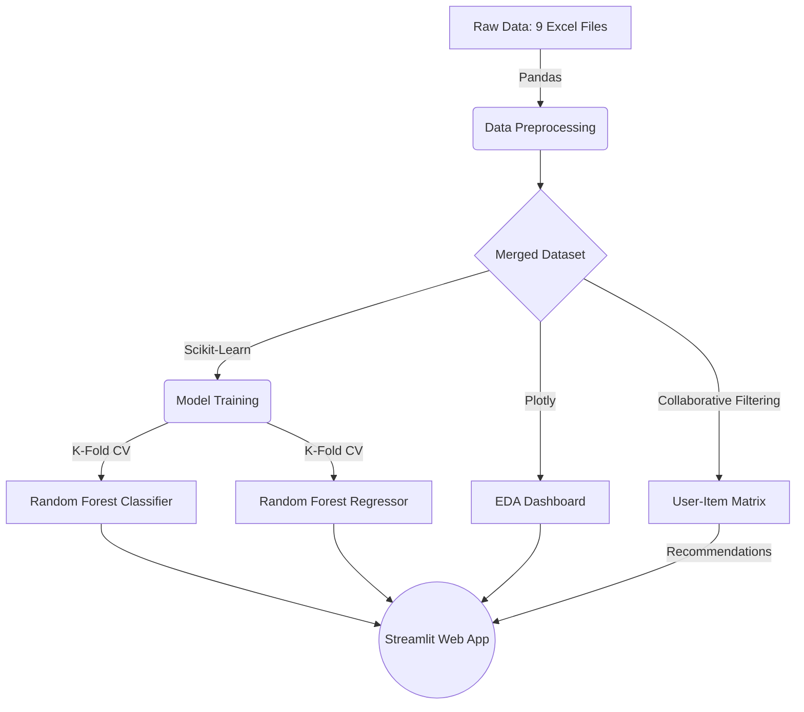

# 🌍 Tourism Experience Analytics 


A comprehensive Machine Learning pipeline and interactive web application designed to analyze user preferences, predict travel patterns, and provide personalized tourist attraction recommendations.

---

## 💡 About the Project

Tourism agencies and travel platforms constantly aim to enhance user experiences by leveraging data. This project solves three core business use cases:
1. **Predictive Modeling (Regression):** Predicting the rating a user might give to a specific tourist attraction based on their demographics and historical patterns.
2. **Customer Segmentation (Classification):** Predicting the mode of visit (e.g., Business, Family, Solo) based on user and transaction features, allowing for targeted promotions.
3. **Personalized Recommendations:** Suggesting attractions based on a user's past visits and similarities with other travelers (Collaborative Filtering).

## ✨ Key Features

- **Interactive UI:** A fully functional frontend built with Streamlit containing tabs for Predictions, Recommendations, and Analytics.
- **Machine Learning Engine:** Powered by Scikit-Learn's `RandomForestRegressor` and `RandomForestClassifier` with 5-Fold Cross-Validation for robust predictions.
- **Model Interpretability:** Extracts and visualizes Feature Importances to explain why the model made a specific prediction.
- **Data Engineering:** Automated scripts to clean, encode, and merge 9 different complex datasets.
- **Interactive EDA Dashboard:** Dynamic Plotly visualizations with custom filtering (e.g., by Visit Year) to uncover geographic hotspots and rating behaviors.

## 🧠 Methodology & Workflow



1. **Data Preprocessing:** Handled missing values, encoded categorical variables, and merged 9 disparate relational datasets into a unified flat schema.
2. **Exploratory Data Analysis:** Identified key trends such as attraction popularity and rating distributions using Plotly.
3. **Model Training & Evaluation:** Trained Random Forest models. Evaluated using K-Fold Cross Validation. Extracted RMSE, MAE, R2 for regression, and Precision, Recall, F1 for classification.
4. **Deployment:** Serialized models using Joblib and deployed an interactive inference application via Streamlit Cloud.

## 🛠️ Tech Stack

- **Language:** Python
- **Frontend Framework:** Streamlit
- **Machine Learning:** Scikit-Learn, XGBoost, LightGBM
- **Data Manipulation:** Pandas, NumPy
- **Data Visualization:** Plotly, Matplotlib, Seaborn

## 📂 Project Structure

```text
├── app/
│   └── main.py                  # The main Streamlit web application
├── data/
│   ├── raw/                     # Original Excel datasets
│   └── processed/               # Cleaned data and serialized ML models (.pkl)
├── src/
│   ├── data_preprocessing.py    # Script for merging and cleaning datasets
│   └── model_training.py        # Script for training classification & regression models
├── requirements.txt             # Python dependencies
└── README.md                    # Project documentation
```

## 🚀 How to Run Locally

Follow these detailed setup instructions to get the project up and running on your local machine.

### 1. Clone the repository
```bash
git clone https://github.com/durg-giri123/tourism-recommendation-system.git
cd tourism-recommendation-system
```

### 2. Set up a Virtual Environment (Recommended)
```bash
python -m venv .venv
# On Windows:
.venv\Scripts\activate
# On Mac/Linux:
source .venv/bin/activate
```

### 3. Install Dependencies
Ensure you have Python 3.9+ installed, then install the required libraries:
```bash
pip install -r requirements.txt
```

### 4. Run Data Pipelines
If you want to re-process the data and re-train the models from scratch (this will overwrite the `.pkl` models):
```bash
python src/data_preprocessing.py
python src/model_training.py
```

### 5. Launch the Streamlit App
Start the interactive application:
```bash
python -m streamlit run app/main.py
```
*The app will automatically open in your default browser at `http://localhost:8501`.*

## 📊 Actionable Business Insights

* **Targeted Marketing:** The application's geographical tracking allows agencies to tailor homepage promotions based on the user's origin continent and expected travel mode (e.g., promoting business-friendly packages to specific segments).
* **Budget Allocation:** Destination management organizations can observe which attraction types (e.g., Beaches vs. Ancient Ruins) have the highest demand and shift their marketing budgets accordingly.
* **Customer Retention:** By accurately predicting ratings and filtering out sub-optimal experiences, the recommendation engine directly improves the end-user's travel satisfaction.

---
*Created by [Durgesh Giri](https://github.com/durg-giri123)*
